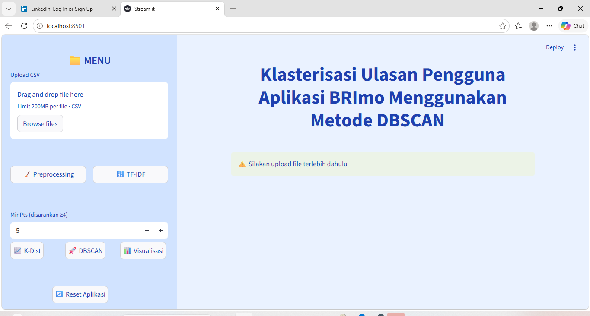

# 📊 BRImo User Review Clustering using DBSCAN

This project analyzes and clusters BRImo user reviews using DBSCAN clustering combined with TF-IDF and preprocessing techniques.

---

## 🚀 Features
- Upload CSV dataset
- Text preprocessing
- TF-IDF transformation
- K-Distance visualization
- DBSCAN clustering
- Cluster visualization

---

## 🛠 Technologies Used
- Python
- Streamlit
- Scikit-learn
- Pandas
- Matplotlib

---

## 📷 Application Preview

---

## 📌 Objective
To analyze user reviews and identify clustering patterns from BRImo application feedback.

---

## 👩‍💻 Author
Leyla Mariela Sidabutar
